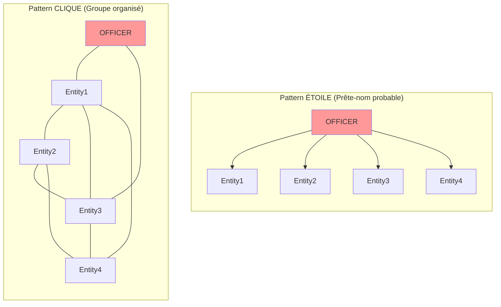
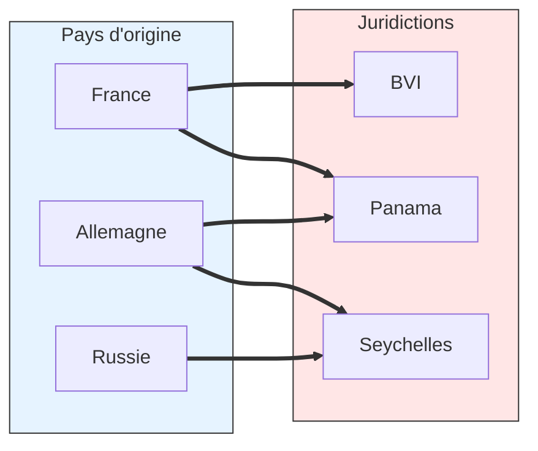
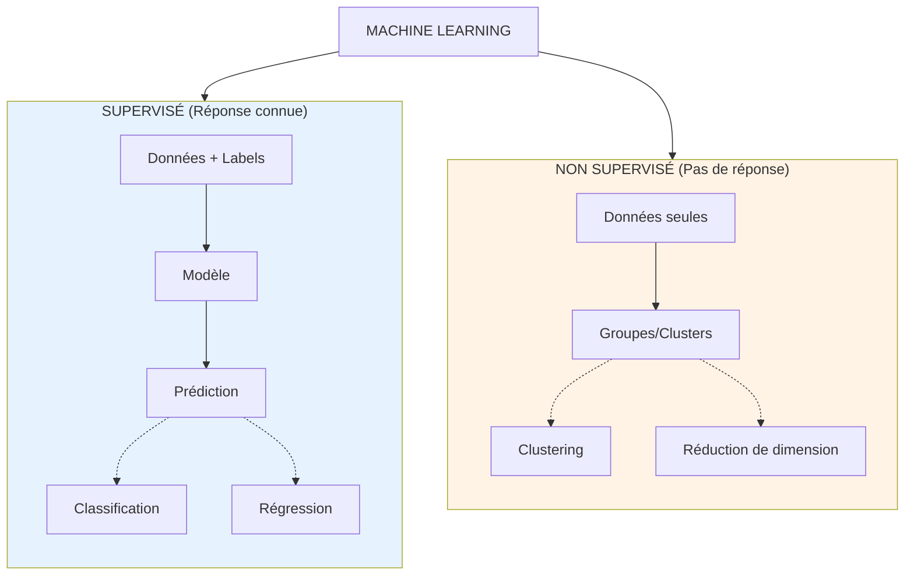
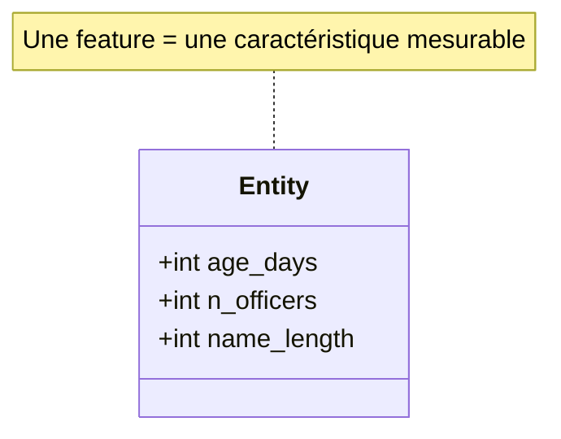
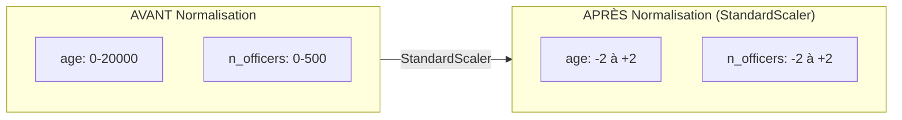
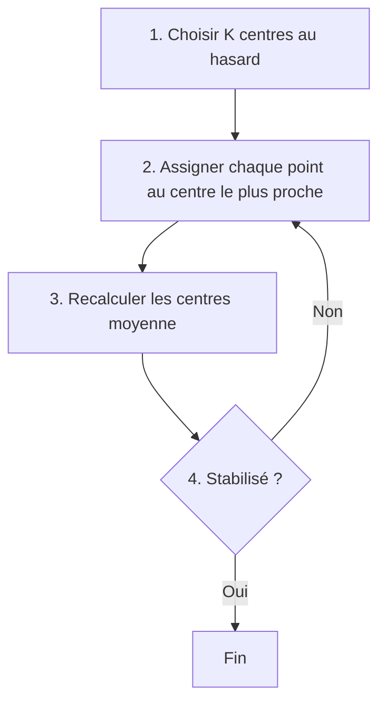
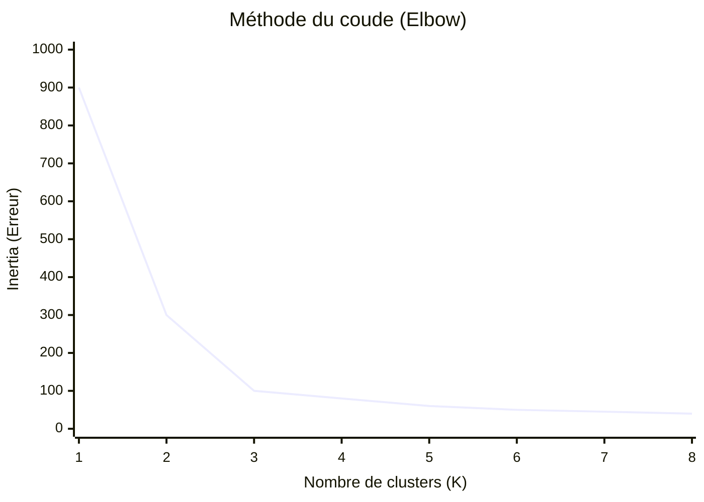
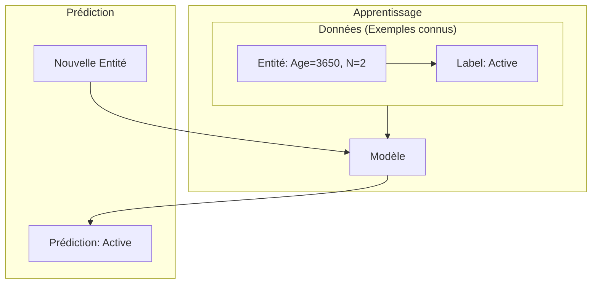
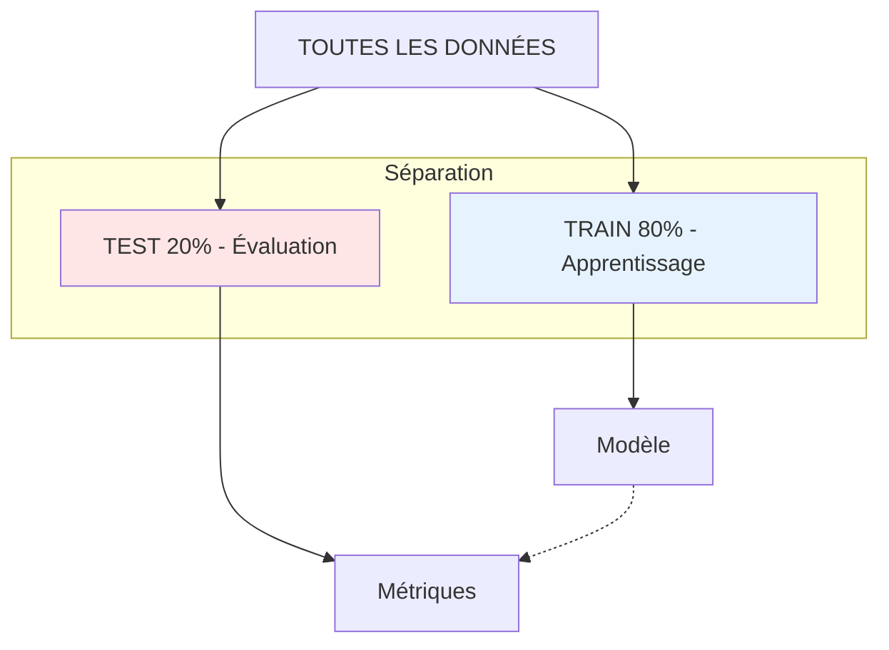

# TD 2 - Data Science : Exploration des Offshore Leaks

## 📋 Informations générales

| | |
|---|---|
| **Module** | Data Science - Python |
| **Niveau** | ING3 |
| **Durée estimée** | 12-15h |
| **Rendu** | Notebook + Rapport PDF |
| **Date limite** | À définir |

---

## 1. Contexte et objectifs

### 1.A. Présentation du projet

L'International Consortium of Investigative Journalists (ICIJ) a publié une base de données contenant plus de **810 000 entités offshore** issues de cinq fuites majeures :

- **Panama Papers** (2016) - Mossack Fonseca
- **Paradise Papers** (2017) - Appleby + registres corporate
- **Pandora Papers** (2021) - 14 prestataires offshore
- **Bahamas Leaks** (2016) - Registre corporate des Bahamas
- **Offshore Leaks** (2013) - Portcullis Trustnet & Commonwealth Trust

### 1.B. Source des données

| Ressource | URL |
|-----------|-----|
| Page principale | <https://offshoreleaks.icij.org/pages/database> |
| Archive CSV | <https://offshoreleaks-data.icij.org/offshoreleaks/csv/full-oldb.LATEST.zip> |
| Documentation | <https://offshoreleaks.icij.org/pages/howtouse> |
| Schéma API REST | <https://offshoreleaks.icij.org/schema/oldb> |

### 1.C. Structure des données

La base est structurée comme un **graphe** avec des nœuds (nodes) et des relations (edges).

```
┌─────────────────────────────────────────────────────────────────────────────┐
│                        STRUCTURE DU GRAPHE ICIJ                             │
├─────────────────────────────────────────────────────────────────────────────┤
│                                                                             │
│    ┌──────────────┐         officer_of          ┌──────────────────┐       │
│    │   OFFICER    │ ───────────────────────────▶│     ENTITY       │       │
│    │  (771,315)   │                             │    (814,344)     │       │
│    │              │                             │                  │       │
│    │ - name       │         shareholder_of      │ - name           │       │
│    │ - countries  │ ───────────────────────────▶│ - jurisdiction   │       │
│    │ - sourceID   │                             │ - company_type   │       │
│    └──────┬───────┘         beneficiary_of      │ - incorporation  │       │
│           │          ───────────────────────────▶│ - status         │       │
│           │                                     └────────┬─────────┘       │
│           │                                              │                 │
│           │ registered_address                           │ registered_addr │
│           ▼                                              ▼                 │
│    ┌──────────────┐                             ┌──────────────────┐       │
│    │   ADDRESS    │                             │  INTERMEDIARY    │       │
│    │  (402,246)   │                             │    (26,768)      │       │
│    │              │                             │                  │       │
│    │ - address    │      intermediary_of        │ - name           │       │
│    │ - countries  │ ◀───────────────────────────│ - countries      │       │
│    │ - sourceID   │                             │ - status         │       │
│    └──────────────┘                             └──────────────────┘       │
│                                                                             │
└─────────────────────────────────────────────────────────────────────────────┘
```

**Fichiers CSV fournis :**

| Fichier | Description | Colonnes principales |
|---------|-------------|---------------------|
| `nodes-entities.csv` | Entités offshore | `node_id`, `name`, `jurisdiction`, `jurisdiction_description`, `company_type`, `incorporation_date`, `inactivation_date`, `status`, `sourceID` |
| `nodes-officers.csv` | Officers (personnes/sociétés) | `node_id`, `name`, `countries`, `sourceID` |
| `nodes-intermediaries.csv` | Intermédiaires | `node_id`, `name`, `countries`, `status`, `sourceID` |
| `nodes-addresses.csv` | Adresses | `node_id`, `address`, `countries`, `sourceID` |
| `relationships.csv` | Relations | `node_id_start`, `node_id_end`, `rel_type`, `sourceID` |

**Types de relations (`rel_type`) :**

- `officer_of` : L'officer est lié à l'entité
- `intermediary_of` : L'intermédiaire a créé/gère l'entité
- `registered_address` : Adresse enregistrée
- `shareholder_of` : Actionnaire
- `beneficiary_of` : Bénéficiaire
- `similar_name_and_address` : Entités potentiellement liées

---

## 2. Environnement technique

### 2.A. Installation des dépendances

```bash
# Initialisation du projet (si nécessaire)
poetry init -n

# Ajout des dépendances
poetry add pandas numpy pyarrow matplotlib seaborn plotly networkx python-louvain scikit-learn rapidfuzz unidecode folium tqdm jupyter ipywidgets
```

### 2.B. Lancement de l'environnement

```bash
# Lancement de Jupyter Lab
poetry run jupyter lab
```

### 2.C. Template de démarrage

```python
# === IMPORTS ===
import pandas as pd
import numpy as np
import matplotlib.pyplot as plt
import seaborn as sns
import networkx as nx
from pathlib import Path
from tqdm import tqdm
import warnings
warnings.filterwarnings('ignore')

# Configuration graphique
plt.style.use('seaborn-v0_8-whitegrid')
sns.set_palette("husl")
plt.rcParams['figure.figsize'] = (12, 6)
plt.rcParams['figure.dpi'] = 100

# === CHARGEMENT DES DONNÉES ===
DATA_DIR = Path("./data/")  # Adapter selon votre structure

# Chargement des nœuds
entities = pd.read_csv(DATA_DIR / "nodes-entities.csv", low_memory=False)
officers = pd.read_csv(DATA_DIR / "nodes-officers.csv", low_memory=False)
intermediaries = pd.read_csv(DATA_DIR / "nodes-intermediaries.csv", low_memory=False)
addresses = pd.read_csv(DATA_DIR / "nodes-addresses.csv", low_memory=False)

# Chargement des relations
relationships = pd.read_csv(DATA_DIR / "relationships.csv", low_memory=False)

# Vérification
print(f"Entities: {len(entities):,}")
print(f"Officers: {len(officers):,}")
print(f"Intermediaries: {len(intermediaries):,}")
print(f"Addresses: {len(addresses):,}")
print(f"Relationships: {len(relationships):,}")
```

---

## 3. Partie 1 : Nettoyage et exploration

```
┌─────────────────────────────────────────────────────────────────┐
│                    WORKFLOW PARTIE 1                            │
├─────────────────────────────────────────────────────────────────┤
│                                                                 │
│   CSV bruts ──▶ Audit qualité ──▶ Nettoyage ──▶ Exploration    │
│                      │                              │           │
│                      ▼                              ▼           │
│              Rapport qualité              Visualisations        │
│              - NaN rates                  - Temporelles         │
│              - Doublons                   - Géographiques       │
│              - Incohérences               - Distributions       │
│                                                                 │
└─────────────────────────────────────────────────────────────────┘
```

### Question 1.A — Taux de valeurs manquantes

**Objectif** : Identifier les colonnes avec des données manquantes.

**Librairies** : `pandas`, `matplotlib`, `seaborn`

**Travail demandé** :

1. Pour chaque fichier CSV (`entities`, `officers`, `intermediaries`, `addresses`), calculez le nombre et le pourcentage de valeurs manquantes par colonne
2. Créez une **heatmap** visualisant les valeurs manquantes pour chaque dataset
3. Produisez un tableau récapitulatif avec le taux global de NaN par fichier

**Indices** : `df.isnull().sum()`, `sns.heatmap()`

**Livrable** : Heatmap + tableau récapitulatif des NaN par dataset

---

### Question 1.B — Détection des doublons exacts

**Objectif** : Identifier les lignes dupliquées dans chaque fichier.

**Librairies** : `pandas`

**Travail demandé** :

1. Comptez les doublons exacts (lignes identiques) dans chaque DataFrame
2. Affichez quelques exemples de doublons pour comprendre leur nature
3. Proposez une stratégie : les supprimer ou les conserver ?

**Indices** : `df.duplicated()`, `df.duplicated(keep=False)`

**Livrable** : Tableau du nombre de doublons par fichier + exemples + justification

---

### Question 1.C — Doublons flous (similarité de noms)

**Objectif** : Détecter les entités avec des noms quasi-identiques (fautes de frappe, variantes).

**Librairies** : `pandas`, `rapidfuzz`

**Travail demandé** :

1. Utilisez `rapidfuzz` pour identifier les noms d'entités avec une similarité > 90%
2. Échantillonnez les données pour éviter une complexité O(n²)
3. Analysez les patterns : fautes fréquentes, variantes orthographiques

**Indices** : `fuzz.ratio()`, `process.extract()`

**Livrable** : Liste des paires de noms similaires + analyse des patterns

---

### Question 1.D — Incohérences temporelles

**Objectif** : Détecter les anomalies dans les dates.

**Librairies** : `pandas`

**Travail demandé** :

1. Parsez les colonnes `incorporation_date` et `inactivation_date` en datetime
2. Identifiez les incohérences :
   - `incorporation_date` > `inactivation_date` (créé après dissolution ?)
   - Dates dans le futur
   - Dates aberrantes (< 1900)
3. Proposez une stratégie de traitement pour chaque type d'anomalie

**Indices** : `pd.to_datetime(errors='coerce')`, `pd.Timestamp.now()`

**Livrable** : Comptage des anomalies par type + exemples + stratégie de traitement

---

### Question 1.E — Cartographie temporelle des créations

**Objectif** : Comprendre l'évolution historique de l'industrie offshore.

**Librairies** : `pandas`, `matplotlib`, `seaborn`, `plotly`

**Travail demandé** :

1. Parsez et nettoyez les dates d'incorporation :

   ```python
   entities['incorporation_date'] = pd.to_datetime(
       entities['incorporation_date'], 
       errors='coerce'
   )
   entities['year'] = entities['incorporation_date'].dt.year
   ```

2. Créez une **courbe globale** du nombre de créations par année

3. Créez un **stacked area chart** par juridiction (top 10) :
   - Identifiez les 10 juridictions avec le plus d'entités (`value_counts().head() and isin(top10)`)
   - Groupez par année ET par juridiction : `groupby(['year', 'jurisdiction']).size()`
   - Pivotez pour avoir les juridictions en colonnes : `.unstack(fill_value=0)`
   - Tracez avec `df.plot.area(stacked=True)`

4. Ajoutez des **annotations** pour les événements clés :
   - Lignes verticales : `plt.axvline(x=2008, color='red', linestyle='--')`
   - Annotations : `plt.annotate('Crise 2008', xy=(2008, y))`

5. Événements à corréler (recherchez les dates) :
   - Crises financières (2008, etc.)
   - Changements réglementaires (FATCA, CRS)
   - Scandales (LuxLeaks, SwissLeaks)

```
Exemple de pattern attendu :
                                                          
Créations │                                    ╱╲         
          │                              ╱╲  ╱  ╲        
          │                         ╱╲  ╱  ╲╱    ╲       
          │                    ╱╲  ╱  ╲╱          ╲      
          │               ╱───╱  ╲╱                ╲     
          │          ╱───╱                          ╲    
          │     ╱───╱                                    
          └────────────────────────────────────────────▶
              1980    1990    2000    2010    2020  Année
```

**Livrable** : Graphiques annotés + analyse des tendances (1 page)

---

### Question 1.F — Analyse comparative des juridictions

**Objectif** : Profiler les différentes juridictions offshore.

**Librairies** : `pandas`, `numpy`, `seaborn`, `plotly`

**Travail demandé** :

1. Pour chaque juridiction, calculez :

| Métrique | Description |
|----------|-------------|
| `n_entities` | Nombre total d'entités |
| `n_officers` | Nombre d'officers uniques connectés |
| `n_intermediaries` | Nombre d'intermédiaires actifs |
| `ratio_officers_entities` | Officers / Entités |
| `avg_lifetime_days` | Durée de vie moyenne |
| `pct_active` | % d'entités encore actives |

1. Créez un **scatter plot** :
   - X : nombre d'entités (log scale)
   - Y : ratio officers/entités  
   - Taille : nombre d'intermédiaires
   - Couleur : durée de vie moyenne

2. Identifiez les juridictions "industrialisées" (beaucoup d'entités, peu d'officers uniques = réutilisation de prête-noms)

**Livrable** : Tableau de synthèse + visualisation + interprétation

---

### Question 1.G — Profilage des intermédiaires

**Objectif** : Identifier et caractériser les acteurs clés de l'industrie offshore.

**Librairies** : `pandas`, `matplotlib`, `seaborn`

**Travail demandé** :

1. Joignez les tables pour obtenir pour chaque intermédiaire :

   ```python
   # Relations intermédiaire -> entité
   inter_rels = relationships[relationships['rel_type'] == 'intermediary_of']
   
   # Enrichissement
   inter_profile = inter_rels.merge(entities, left_on='node_id_end', right_on='node_id')
   ```

2. Calculez par intermédiaire :
   - Nombre total d'entités créées
   - Période d'activité (première et dernière création)
   - Distribution des juridictions (top 5)
   - Pays d'origine des clients (via addresses des officers)

3. Visualisez le **top 20** sous forme de :
   - Bar chart horizontal (nombre d'entités)
   - Heatmap intermédiaire × juridiction

4. **Question clé** : Mossack Fonseca est-il vraiment #1 ? Comparez avec Appleby, Trident Trust, etc.

**Livrable** : Fiches profil des top 10 intermédiaires + analyse comparative

---

### Question 1.H — Détection d'anomalies dans les noms

**Objectif** : Identifier des patterns suspects dans les noms d'entités.

**Librairies** : `pandas`, `re`, `rapidfuzz`, `unidecode`

**Travail demandé** :

1. **Noms génériques** — Détectez les entités avec noms "passe-partout" :

   ```python
   generic_patterns = [
       r'^(Global|International|Universal|World)\s+(Holdings|Investment|Trading)',
       r'^[A-Z]{2,4}\s+(Ltd|LLC|Corp|Inc)\.?$',  # "ABC Ltd"
       r'(Nominee|Proxy|Bearer)',
   ]
   ```

2. **Near-duplicates** — Trouvez les entités quasi-identiques :

   ```python
   from rapidfuzz import process, fuzz
   
   # Pour chaque entité, trouver les noms avec distance < 3
   # Attention : O(n²) → échantillonnez ou utilisez des index
   ```

3. **Caractères suspects** :

   ```python
   from unidecode import unidecode
   
   # Détecter : caractères cyrilliques dans noms "latins"
   # Homoglyphes : О (cyrillique) vs O (latin)
   ```

**Livrable** : Liste des entités suspectes par catégorie + analyse des patterns

---

## 4. Partie 2 : Analyse de réseau

```
┌─────────────────────────────────────────────────────────────────────────────┐
│                         PIPELINE ANALYSE RÉSEAU                             │
├─────────────────────────────────────────────────────────────────────────────┤
│                                                                             │
│   relationships.csv                                                         │
│         │                                                                   │
│         ▼                                                                   │
│   ┌───────────┐     ┌──────────────┐     ┌─────────────────┐              │
│   │ NetworkX  │────▶│  Métriques   │────▶│  Visualisation  │              │
│   │   Graph   │     │  globales    │     │                 │              │
│   └───────────┘     └──────────────┘     └─────────────────┘              │
│         │                                                                   │
│         ▼                                                                   │
│   ┌───────────┐     ┌──────────────┐                                       │
│   │Centralité │────▶│ Communautés  │                                       │
│   │  (hubs)   │     │  (Louvain)   │                                       │
│   └───────────┘     └──────────────┘                                       │
│                                                                             │
└─────────────────────────────────────────────────────────────────────────────┘
```

### Question 2.A — Construction et métriques du graphe

**Objectif** : Construire le graphe de relations et calculer ses propriétés globales.

**Librairies** : `networkx`, `pandas`, `matplotlib`, `numpy`

**Travail demandé** :

1. Construisez le graphe :

   ```python
   import networkx as nx
   
   G = nx.Graph()  # ou DiGraph pour orienté
   
   # Ajout des nœuds avec attributs
   for _, row in entities.iterrows():
       G.add_node(row['node_id'], 
                  type='entity', 
                  name=row['name'],
                  jurisdiction=row['jurisdiction'])
   
   # Idem pour officers, intermediaries, addresses
   
   # Ajout des arêtes
   for _, row in relationships.iterrows():
       G.add_edge(row['node_id_start'], 
                  row['node_id_end'],
                  rel_type=row['rel_type'])
   ```

2. Calculez les métriques globales :

| Métrique | Formule/Fonction | Interprétation |
|----------|------------------|----------------|
| Nombre de nœuds | `G.number_of_nodes()` | Taille du réseau |
| Nombre d'arêtes | `G.number_of_edges()` | Connexions |
| Densité | `nx.density(G)` | Ratio arêtes réelles/possibles |
| Composantes connexes | `nx.number_connected_components(G)` | Fragmentation |
| Coefficient de clustering | `nx.average_clustering(G)` | Tendance aux triangles |

1. **Distribution des degrés** — Tracez un histogramme et vérifiez si le graphe suit une loi de puissance :

   ```python
   degrees = [d for n, d in G.degree()]
   
   # Histogramme
   plt.hist(degrees, bins=50, log=True)
   plt.xlabel('Degré')
   plt.ylabel('Fréquence (log)')
   plt.title('Distribution des degrés')
   ```

**Livrable** : Tableau de métriques + graphique distribution des degrés + interprétation

---

### Question 2.B — Identification des hubs (centralité)

**Objectif** : Trouver les nœuds les plus importants du réseau.

**Librairies** : `networkx`, `pandas`, `matplotlib`

**Travail demandé** :

1. Calculez la centralité de degré :

   ```python
   # Degree centrality (rapide)
   degree_cent = nx.degree_centrality(G)
   
   # Top 50
   top_nodes = sorted(degree_cent.items(), key=lambda x: x[1], reverse=True)[:50]
   ```

2. Analysez la **nature des hubs** :
   - Sont-ils des officers, entities, ou intermediaries ?

3. **Visualisez l'ego-network** des 3 nœuds les plus centraux :

   ```python
   def plot_ego_network(G, node, radius=1):
       ego = nx.ego_graph(G, node, radius=radius)
       pos = nx.spring_layout(ego, k=0.5)
       nx.draw(ego, pos, with_labels=False, node_size=50, alpha=0.7)
       plt.title(f"Ego-network de {node}")
       plt.show()
   ```

**Livrable** : Classement des hubs + ego-networks + analyse du rôle des super-connecteurs

---

### Question 2.C — Détection de communautés

**Objectif** : Identifier les groupes cohérents dans le réseau.

**Librairies** : `networkx`, `community` (python-louvain), `matplotlib`

**Travail demandé** :

1. Appliquez l'algorithme de **Louvain** :

   ```python
   import community as community_louvain
   
   # Sur la plus grande composante connexe (pour éviter les erreurs)
   largest_cc = max(nx.connected_components(G), key=len)
   G_largest = G.subgraph(largest_cc).copy()
   
   partition = community_louvain.best_partition(G_largest)
   
   # Modularité
   modularity = community_louvain.modularity(partition, G_largest)
   print(f"Modularité : {modularity:.3f}")
   ```

2. Caractérisez les **5 plus grandes communautés** :

| Communauté | Taille | % Officers | % Entities | Top juridiction | Top intermédiaire |
|------------|--------|------------|------------|-----------------|-------------------|
| 0 | ... | ... | ... | ... | ... |

1. **Hypothèse à tester** : Les communautés sont-elles organisées par juridiction ? par intermédiaire ?

**Livrable** : Tableau de caractérisation + interprétation de l'organisation

---

### Question 2.D — Patterns de prête-noms

**Objectif** : Identifier les structures de réseau suspectes.

**Librairies** : `networkx`, `matplotlib`

**Travail demandé** :

1. Identifiez les officers connectés à **> 50 entités** :

   ```python
   suspicious_officers = [
       n for n, d in G.degree() 
       if G.nodes[n].get('type') == 'officer' and d > 50
   ]
   print(f"Officers suspects : {len(suspicious_officers)}")
   ```

2. Pour chaque officer suspect, analysez la **structure** de son réseau :



1. Calculez pour chaque officer suspect :

   ```python
   def analyze_officer_network(G, officer_node):
       neighbors = list(G.neighbors(officer_node))
       subgraph = G.subgraph(neighbors)
       
       return {
           'n_entities': len(neighbors),
           'density_without_officer': nx.density(subgraph),
           'clustering': nx.clustering(G, officer_node)
       }
   ```

2. Classifiez :
   - **Étoile pure** : density ≈ 0 → probable prête-nom
   - **Clique** : density > 0.3 → groupe organisé

**Livrable** : Liste des officers suspects classifiés + visualisations des patterns types

---

## 5. Partie 3 : Analyse géographique



### Question 3.A — Matrice origine-destination

**Objectif** : Cartographier les flux entre pays d'origine et juridictions offshore.

**Librairies** : `pandas`, `seaborn`, `plotly`

**Travail demandé** :

1. Construisez la matrice de flux :

   ```python
   # Jointure : officer -> entity -> juridiction
   # + officer -> address -> pays d'origine
   
   flows = merged_data.groupby(
       ['origin_country', 'jurisdiction']
   ).size().reset_index(name='count')
   
   # Pivot pour heatmap
   matrix = flows.pivot(
       index='origin_country', 
       columns='jurisdiction', 
       values='count'
   ).fillna(0)
   ```

2. **Heatmap** des top 15 pays × top 15 juridictions :

   ```python
   plt.figure(figsize=(12, 10))
   sns.heatmap(matrix_top, annot=True, fmt='.0f', cmap='YlOrRd')
   plt.title('Flux pays → juridictions')
   ```

3. Identifiez les **"corridors" principaux** :
   - France → Luxembourg/Suisse
   - Russie → Chypre/BVI
   - etc.

**Livrable** : Heatmap + analyse des 10 principaux corridors

---

### Question 3.B — Comparaison des sources de fuites

**Objectif** : Caractériser les "marchés" révélés par chaque fuite.

**Librairies** : `pandas`, `matplotlib`, `seaborn`

**Travail demandé** :

1. Segmentez les données par `sourceID` :
   - `Panama Papers`
   - `Paradise Papers`
   - `Pandora Papers`
   - `Bahamas Leaks`
   - `Offshore Leaks`

2. Pour chaque source, calculez :

| Métrique | Panama | Paradise | Pandora | Bahamas | Offshore |
|----------|--------|----------|---------|---------|----------|
| Nb entités | | | | | |
| Top 3 juridictions | | | | | |
| Top 3 pays clients | | | | | |
| Période couverte | | | | | |

1. **Analyse** : Les fuites révèlent-elles des "marchés" offshore distincts ?

**Livrable** : Tableau comparatif + analyse

---

## 6. Partie 4 : Introduction au Machine Learning

> **🎓 Note pédagogique** : Cette partie est une introduction aux concepts de base du Machine Learning. Prenez le temps de comprendre chaque étape avant de passer à la suivante.

### 6.0. C'est quoi le Machine Learning ?



**Librairie principale** : `scikit-learn` (sklearn)

```python
# Imports classiques pour le ML
from sklearn.cluster import KMeans
from sklearn.model_selection import train_test_split
from sklearn.preprocessing import StandardScaler
from sklearn.tree import DecisionTreeClassifier
from sklearn.metrics import accuracy_score
```

---

### Question 4.A — Préparation des données pour le ML

**Objectif** : Transformer nos données brutes en un format utilisable par les algorithmes de ML.

**Librairies** : `pandas`, `sklearn`, `matplotlib`

#### 🎓 Concept clé : Les Features (caractéristiques)



| Entité | age (jours) | n_officers | name_length |
| :--- | :--- | :--- | :--- |
| ABC Holdings | 3650 | 2 | 12 |
| XYZ Trust Ltd | 1825 | 5 | 13 |
| Global Corp | 365 | 1 | 11 |

*Chaque ligne = un échantillon (sample)*
*Chaque colonne = une feature*

**Travail demandé** :

1. **Créez un DataFrame avec des features simples** :

```python
# Calculer l'âge de chaque entité
entities['incorporation_date'] = pd.to_datetime(entities['incorporation_date'], errors='coerce')
entities['age_days'] = (pd.Timestamp.now() - entities['incorporation_date']).dt.days

# Compter le nombre d'officers par entité
officer_counts = relationships[relationships['rel_type'] == 'officer_of'] \
    .groupby('node_id_end').size() \
    .reset_index(name='n_officers')

# Fusionner avec entities
entities_ml = entities.merge(officer_counts, left_on='node_id', right_on='node_id_end', how='left')
entities_ml['n_officers'] = entities_ml['n_officers'].fillna(0)

# Longueur du nom
entities_ml['name_length'] = entities_ml['name'].str.len()
```

1. **Créez ces features simples** :

| Feature | Comment la calculer | Pourquoi c'est utile |
|---------|---------------------|----------------------|
| `age_days` | Date du jour - date d'incorporation | Les vieilles entités ont des patterns différents |
| `n_officers` | Comptage via relationships | Beaucoup d'officers = structure complexe |
| `name_length` | `len(name)` | Noms courts souvent génériques |

1. **Gérez les valeurs manquantes** :

```python
# Voir les NaN
print(entities_ml.isnull().sum())

# Supprimer les lignes avec NaN dans nos features
entities_clean = entities_ml.dropna(subset=['age_days', 'n_officers', 'name_length'])
print(f"Entités restantes : {len(entities_clean)}")
```

1. **Normalisez les données** (très important !) :



```python
from sklearn.preprocessing import StandardScaler

# Sélectionner les colonnes numériques
features = ['age_days', 'n_officers', 'name_length']
X = entities_clean[features].values

# Normaliser
scaler = StandardScaler()
X_scaled = scaler.fit_transform(X)

# Vérification
print(f"Moyenne après scaling : {X_scaled.mean(axis=0)}")  # Proche de 0
print(f"Écart-type après scaling : {X_scaled.std(axis=0)}")  # Proche de 1
```

**Livrable** : DataFrame `entities_ml` avec au moins 3 features + données normalisées

---

### Question 4.B — Clustering avec K-Means (apprentissage non supervisé)

**Objectif** : Regrouper automatiquement les entités similaires.

**Librairies** : `sklearn`, `matplotlib`, `seaborn`

#### 🎓 Concept clé : Comment fonctionne K-Means ?



**Travail demandé** :

1. **Appliquez K-Means avec K=3** (pour commencer) :

```python
from sklearn.cluster import KMeans

# Créer le modèle
kmeans = KMeans(n_clusters=3, random_state=42, n_init=10)

# Entraîner sur les données normalisées
kmeans.fit(X_scaled)

# Récupérer les labels (0, 1 ou 2 pour chaque entité)
entities_clean['cluster'] = kmeans.labels_

# Voir la répartition
print(entities_clean['cluster'].value_counts())
```

1. **Trouvez le bon nombre de clusters** avec la méthode du coude (Elbow) :



```python
# Tester différentes valeurs de K
inertias = []
K_range = range(2, 11)

for k in K_range:
    kmeans = KMeans(n_clusters=k, random_state=42, n_init=10)
    kmeans.fit(X_scaled)
    inertias.append(kmeans.inertia_)

# Tracer la courbe
plt.figure(figsize=(10, 6))
plt.plot(K_range, inertias, 'bo-', linewidth=2, markersize=8)
plt.xlabel('Nombre de clusters (K)')
plt.ylabel('Inertie')
plt.title('Méthode du coude pour choisir K')
plt.grid(True)
plt.show()
```

1. **Visualisez les clusters** (en 2D) :

```python
# Visualisation simple avec 2 features
plt.figure(figsize=(10, 8))
scatter = plt.scatter(
    entities_clean['age_days'], 
    entities_clean['n_officers'],
    c=entities_clean['cluster'],  # Couleur par cluster
    cmap='viridis',
    alpha=0.5
)
plt.xlabel('Âge (jours)')
plt.ylabel("Nombre d'officers")
plt.title('Clusters d\'entités offshore')
plt.colorbar(scatter, label='Cluster')
plt.show()
```

1. **Interprétez les clusters** — Calculez le profil moyen de chaque cluster :

```python
# Profil moyen par cluster
cluster_profiles = entities_clean.groupby('cluster')[features].mean()
print(cluster_profiles)

# Ajoutez des infos qualitatives
for cluster_id in entities_clean['cluster'].unique():
    subset = entities_clean[entities_clean['cluster'] == cluster_id]
    print(f"\n=== CLUSTER {cluster_id} ({len(subset)} entités) ===")
    print(f"Top juridictions : {subset['jurisdiction'].value_counts().head(3).to_dict()}")
    print(f"% actives : {(subset['status'] == 'Active').mean()*100:.1f}%")
```

**Livrable** :

- Courbe du coude + choix de K justifié
- Visualisation des clusters
- Tableau d'interprétation : "Le cluster X contient des entités qui..."

---

### Question 4.C — Classification simple (apprentissage supervisé)

**Objectif** : Prédire si une entité est active ou inactive.

**Librairies** : `sklearn`, `matplotlib`

#### 🎓 Concept clé : Supervisé = on a les réponses pour apprendre



**Travail demandé** :

1. **Préparez les données pour la classification** :

```python
from sklearn.model_selection import train_test_split

# Variable cible : est-ce que l'entité est active ?
entities_clean['is_active'] = (entities_clean['status'] == 'Active').astype(int)

# Features (X) et cible (y)
X = entities_clean[['age_days', 'n_officers', 'name_length']].values
y = entities_clean['is_active'].values

# IMPORTANT : Séparer en train (80%) et test (20%)
X_train, X_test, y_train, y_test = train_test_split(
    X, y, 
    test_size=0.2,      # 20% pour le test
    random_state=42     # Pour reproductibilité
)

print(f"Train : {len(X_train)} échantillons")
print(f"Test : {len(X_test)} échantillons")
```



1. **Entraînez un modèle simple : l'Arbre de Décision** :

```python
from sklearn.tree import DecisionTreeClassifier
from sklearn.metrics import accuracy_score, classification_report

# Créer et entraîner le modèle
tree = DecisionTreeClassifier(max_depth=5, random_state=42)
tree.fit(X_train, y_train)

# Prédire sur le test
y_pred = tree.predict(X_test)

# Évaluer
accuracy = accuracy_score(y_test, y_pred)
print(f"Accuracy : {accuracy:.2%}")
print("\nRapport détaillé :")
print(classification_report(y_test, y_pred, target_names=['Inactive', 'Active']))
```

**🎓 Comprendre les métriques** :

```
┌─────────────────────────────────────────────────────────────────────────────┐
│                       MÉTRIQUES DE CLASSIFICATION                           │
├─────────────────────────────────────────────────────────────────────────────┤
│                                                                             │
│  ACCURACY = % de bonnes prédictions globales                               │
│           = Nombre de prédictions correctes / Total                        │
│                                                                             │
│  Exemple : 85 bonnes prédictions sur 100 → Accuracy = 85%                  │
│                                                                             │
│  ┌─────────────────────────────────────────┐                               │
│  │       MATRICE DE CONFUSION              │                               │
│  │                                         │                               │
│  │              Prédit                     │                               │
│  │           Inactif  Actif                │                               │
│  │  Réel   ┌─────────┬─────────┐           │                               │
│  │ Inactif │   40    │   10    │  → 40 bien classés, 10 erreurs            │
│  │         ├─────────┼─────────┤           │                               │
│  │  Actif  │    5    │   45    │  → 45 bien classés, 5 erreurs             │
│  │         └─────────┴─────────┘           │                               │
│  │                                         │                               │
│  │  Accuracy = (40 + 45) / 100 = 85%       │                               │
│  └─────────────────────────────────────────┘                               │
│                                                                             │
└─────────────────────────────────────────────────────────────────────────────┘
```

1. **Visualisez l'arbre de décision** :

```python
from sklearn.tree import plot_tree

plt.figure(figsize=(20, 10))
plot_tree(
    tree, 
    feature_names=['age_days', 'n_officers', 'name_length'],
    class_names=['Inactive', 'Active'],
    filled=True,
    rounded=True,
    max_depth=3  # Limiter l'affichage pour lisibilité
)
plt.title("Arbre de décision : Prédiction du statut")
plt.tight_layout()
plt.show()
```

1. **Quelles features sont importantes ?**

```python
# Importance des features
importances = pd.Series(
    tree.feature_importances_,
    index=['age_days', 'n_officers', 'name_length']
).sort_values(ascending=True)

plt.figure(figsize=(8, 5))
importances.plot(kind='barh', color='steelblue')
plt.xlabel('Importance')
plt.title('Importance des features pour prédire le statut')
plt.tight_layout()
plt.show()
```

**Livrable** :

- Accuracy sur le jeu de test
- Visualisation de l'arbre de décision
- Graphique d'importance des features
- Interprétation : "La feature la plus importante est... car..."

---

### Question 4.D — Aller plus loin (bonus)

**Objectif** : Explorer des améliorations simples.

**Travail demandé** (choisissez 1 ou 2) :

1. **Matrice de confusion visuelle** :

```python
from sklearn.metrics import confusion_matrix, ConfusionMatrixDisplay

cm = confusion_matrix(y_test, y_pred)
disp = ConfusionMatrixDisplay(confusion_matrix=cm, display_labels=['Inactive', 'Active'])
disp.plot(cmap='Blues')
plt.title('Matrice de confusion')
plt.show()
```

1. **Comparez avec Random Forest** (forêt d'arbres qui votent) :

```python
from sklearn.ensemble import RandomForestClassifier

rf = RandomForestClassifier(n_estimators=100, max_depth=5, random_state=42)
rf.fit(X_train, y_train)
y_pred_rf = rf.predict(X_test)

print(f"Arbre simple : {accuracy_score(y_test, y_pred):.2%}")
print(f"Random Forest : {accuracy_score(y_test, y_pred_rf):.2%}")
```

1. **Ajouter une nouvelle feature** et voir l'impact :
   - Exemple : présence de mots-clés suspects dans le nom

```python
entities_clean['has_suspicious_word'] = entities_clean['name'].str.contains(
    'nominee|bearer|trust', case=False, regex=True
).astype(int)
```

**Livrable** : Code + observations sur les améliorations testées

---

## 8. Ressources

- NetworkX : <https://networkx.org/documentation/stable/>
- Scikit-learn : <https://scikit-learn.org/stable/>
- Pandas : <https://pandas.pydata.org/docs/>
- ICIJ : <https://offshoreleaks.icij.org/pages/howtouse>

---

## ⚠️ Avertissement éthique

> *"There are legitimate uses for offshore companies and trusts. The inclusion of a person or entity in the ICIJ Offshore Leaks Database is not intended to suggest or imply that they have engaged in illegal or improper conduct."*
> — ICIJ Disclaimer

Ce TD a une vocation **pédagogique**. Restez factuels dans vos analyses.

---

**Bon courage ! 🚀**
